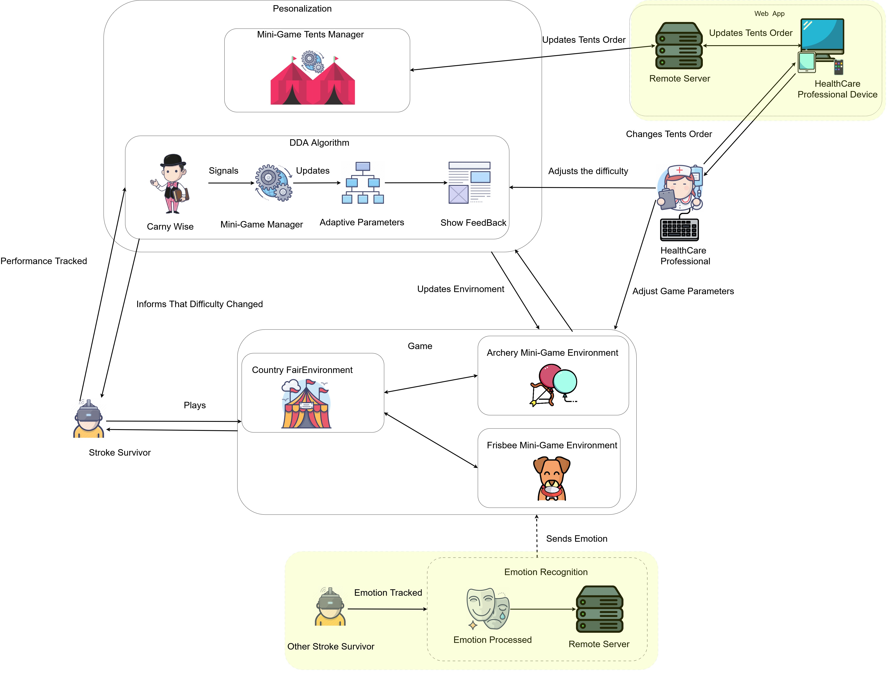

# 🎡 Personalized CountryFair VR

A VR serious game for stroke rehabilitation, featuring adaptive mini-games in an immersive country fair environment built for Meta Quest 3 with hand-tracking support.

This repository contains the source code developed as part of a Master's Thesis titled *"Exploring the Effect of a Personalized Virtual Reality Serious Game for Stroke Rehabilitation"*, focused on stroke survivor rehabilitation using Virtual Reality Serious Games.

---

# 📺 Demo

### [CountryFair VR Demo](https://www.youtube.com/watch?v=bDXMD0OPzRI)

---

# 🔍 Overview

CountryFair VR is a VR serious game designed to enhance post-stroke rehabilitation through immersive, gamified exercises targeting upper-limb motor recovery. The project targets **Meta Quest 3** with hand-tracking support and was developed in **Unity 6000.2.5f1**. It features two rehabilitation mini-games set within an interactive country fair hub (`CountryFair.unity`) with 3D spatial audio, and incorporates a rule-based Dynamic Difficulty Adjustment (DDA) system **CarnyWise** (`CarnyWise.cs`) that continuously adapts challenge parameters to the player's performance, maintaining an optimal flow state during rehabilitation sessions.

The system was developed using a Human-Centered Design (HCD) methodology in collaboration with the **Rovisco Pais Rehabilitation Center** and validated through user testing with **38 participants**.

---

# 🎯 The Problem

Traditional post-stroke rehabilitation often suffers from low patient adherence due to the monotony of repetitive exercises and a lack of personalization in the therapeutic process.

---

# 💡 Our Approach

We propose a solution set in a VR Country Fair environment, designed to enhance stroke survivor motivation and engagement. The system utilizes:

- **Immersive Virtual Reality** and serious mini-games to combat demotivation and increase engagement among stroke survivors.
- A **rule-based Dynamic Difficulty Adjustment (DDA)** system `CarnyWise` that adapts game parameters in real time based on stroke survivor performance (precision and time), promoting an optimal flow state via consecutive-attempt counters and configurable thresholds.
- **3D spatial audio** (via FMOD) to reinforce environmental immersion and provide directional feedback.
- **Hand-tracking interaction** on Meta Quest 3 — pinch gestures detected in `BowHandTracking.cs` with controller fallback — enabling natural gesture-based gameplay without controllers.
- **Personalized hub layout** — healthcare professionals can grab and rearrange mini-game tents (`MiniGameTent.cs`, `TentsPlaceHolderManager.cs`) before each session to set the desired activity order for the stroke survivor, using the Meta XR Distance Grab interaction.
- **Hybrid difficulty personalization via cheat codes** — beyond automated DDA, healthcare professionals can manually adjust the difficulty level at runtime using a keyboard cheat code system (`CheatCodes.cs`, `MiniGameCheatCodes.cs`), creating a **hybrid personalization model** that combines automatic adaptation with direct clinician control. The same system also exposes additional session management capabilities (skipping tutorial phases, triggering score/miss events, controlling the emotion display), though these fall outside the scope of personalization itself.
- **Networked emotion display** — a therapist-facing system streams stroke survivor emotional state in real time via TCP (`ServerListener.cs`) and Unity Netcode (`ExpressionDisplay.cs`, `SliderDisplay.cs`), with three randomly-selected display modes per session: emoji faces, facial expressions, and a cumulative mood slider.
- **Score and streak system** (`ScoreAndStreakSystem.cs`) with DOTween-animated UI feedback and session goal tracking.
- **JSON-driven dialogue system** (`UIDialog.cs`) for onboarding dialogues and tutorial flows, loading from `StreamingAssets/DialogFiles/`.

## Implemented Mini-games

- 🏹🎈 **Archery (`ArcheryGame.unity`):** A balloon-target shooting game where the player uses a virtual bow (hand-tracking via `BowHandTracking.cs`, trajectory preview via `TrajectoryLine.cs`). `ArcheryGameManager.cs` spawns colored balloons inside a defined volume and uses AnimationCurves to scale balloon count, movement ratio, transparency ratio, and movement speed with difficulty.
- 🥏🐶 **Frisbee (`FrisbeeGame.unity`):** A throwing game where the player tosses a frisbee for a dog to catch. `FrisbeeGameManager.cs` spawns score areas around the player at adaptive distances and uses AnimationCurves to control movement and visibility ratios. Dog AI is driven by a five-state FSM (`DogIdle`, `GoToTarget`, `Jump`, `CatchFrisbee`, `GiveFrisbeeToPlayer`).

---

# 📁 Project Structure

```
CountryFair/
├── Assets/
│   ├── Scenes/
│   │   ├── CountryFair.unity          # Hub world scene
│   │   └── MiniGames/
│   │       ├── ArcheryGame.unity      # Archery mini-game scene
│   │       └── FrisbeeGame.unity      # Frisbee mini-game scene
│   ├── Scripts/
│   │   ├── General/
│   │   │   ├── GameManagment/         # GameManager (singleton), AudioManager, CheatCodes, FoveatedRenderingController
│   │   │   ├── Animals/               # Needs-based animal AI (AnimalUtility, AnimalState, AnimalWalk, AnimalEat, AnimalIdle)
│   │   │   ├── Balloons/              # BalloonsSpawner, PopBalloon (hub-world decorative balloons)
│   │   │   ├── Others/                # WanderingPerson, AnimatableState, TextAnim, ButtonPressed
│   │   │   └── UIDialog/              # JSON-driven dialogue base class (UIDialog, JSONData)
│   │   ├── CountryFair/
│   │   │   ├── Management/            # CountryFairAudioManager, CountryFairCheatCodes
│   │   │   ├── Dialogue/              # CountryFairDialogue + JSON data types (IntroData, SessionCompletedData)
│   │   │   ├── Tents/                 # MiniGameTent, TentPlaceHolder, TentsPlaceHolderManager
│   │   │   └── Other/                 # CabinScript, RotateWheel, SheepAnim, CountryFairBalloonSpawner
│   │   ├── MiniGames/
│   │   │   ├── CommonElements/
│   │   │   │   ├── MiniGamesManagment/  # MiniGameManager (abstract), MiniGameAudioManager, MiniGameCheatCodes
│   │   │   │   ├── DDASystem/           # CarnyWise (DDA engine), CarnyWiseDiffFeedback (UI feedback)
│   │   │   │   ├── Tutorial/            # Tutorial, TutorialData
│   │   │   │   ├── UI/                  # ScoreAndStreakSystem, Emotions/ (EmotionDisplay, ExpressionDisplay, SliderDisplay, ServerListener, ConnectionManager)
│   │   │   │   └── ReturnToFair.cs      # Scene transition back to hub
│   │   │   ├── ArcheryGame/
│   │   │   │   ├── GameManagment/       # ArcheryGameManager, ArcheryAudioManager, ArcheryCheatCodes
│   │   │   │   ├── ArcheryStuff/        # BowHandTracking, Arrow, TrajectoryLine
│   │   │   │   ├── Balloons/            # BalloonArcheryGame (target logic: movement, transparency)
│   │   │   │   └── Persons/             # Crowd, IdlePerson (crowd ambient behavior)
│   │   │   ├── FrisbeeGame/
│   │   │   │   ├── GameManagment/       # FrisbeeGameManager, FrisbeeAudioManager, FrisbeeCheatCodes
│   │   │   │   ├── Dog/                 # DogFootSteps + FSM states (DogState, DogIdle, GoToTarget, Jump, CatchFrisbee, GiveFrisbeeToPlayer)
│   │   │   │   ├── Frisbee/             # FrisbeeTrajectory, FollowPlayerHead + FSM states (FrisbeeState, Landed, OnMovement, OnPlayerFront)
│   │   │   │   └── ScoreArea/           # ScoreAreaProperties, ScoreAreaAnimations
│   │   │   └── DuckGame/
│   │   │       └── DuckSwim.cs          # NavMesh-based duck wandering with bobbing and wobble animation
│   │   └── Utils/
│   │       ├── FSM/                   # FSM, State, Transition (generic finite state machine framework)
│   │       └── Utils.cs               # RandomValueInRange, GetChildren helpers
│   └── Plugins/                       # FMOD, DOTween, Meta XR SDK, Demigiant
├── StreamingAssets/
│   └── DialogFiles/                   # JSON files for all dialogue and tutorial content
└── Packages/
    └── manifest.json                  # Unity Package Manager dependencies
```

---

# 🏗️ Architecture Overview



### Singletons / Managers

| Class | Pattern | Responsibility |
|---|---|---|
| `GameManager` | Singleton (non-MonoBehaviour) | Cross-scene session state flags (`IntroCompleted`, `FrisbeeTutorialCompleted`, `ArcheryTutorialCompleted`, `FrisbeeSessionCompleted`, `ArcherySessionCompleted`) |
| `AudioManager` | MonoBehaviour | FMOD event management for shared audio |
| `CountryFairAudioManager` | MonoBehaviour | Hub-world FMOD events |
| `MiniGameAudioManager` (abstract) | MonoBehaviour | Base for `FrisbeeAudioManager`, `ArcheryAudioManager` |

### Scene Composition

Three self-contained scenes connected by `SceneManager.LoadScene`:
- **`CountryFair`** → hub world, intro dialogue, tent selection/rearrangement
- **`ArcheryGame`** / **`FrisbeeGame`** → mini-game sessions; return to `CountryFair` on goal completion via `CarnyWise.SessionGoalReached()`

### Communication Patterns

- **`UnityEvent<T>`** primary cross-component wiring done in Inspector (e.g., `CarnyWise.changeDifficulty` → `MiniGameManager.ChangeDifficulty`, `ScoreAndStreakSystem.sessionGoalReached` → `CarnyWise.SessionGoalReached`)
- **`PlayerPrefs`** cross-scene persistence for difficulty levels (`FrisbeeDifficultyLevel`, `ArcheryDifficultyLevel`), dog distance (`DogDistance`), session goal (`SessionGoal`), and scoring color (`BalloonColorToScore`)
- **`NetworkVariable<T>`** (Unity Netcode) server-authoritative sync for `ExpressionDisplay` and `SliderDisplay`

### Finite State Machine (FSM)

`FSM.cs` / `State.cs` / `Transition.cs` a serializable FSM used by both animal ambients and mini-game actors:

```
State (abstract)
└── AnimatableState (adds Animator support)
    ├── AnimalState → AnimalWalk / AnimalEat / AnimalIdle  (needs-based, driven by AnimalUtility)
    ├── DogState    → DogIdle / GoToTarget / Jump / CatchFrisbee / GiveFrisbeeToPlayer
    └── FrisbeeState → OnPlayerFront / OnMovement / Landed
```

### DDA Loop (`CarnyWise.cs`)

```
Player scores / misses → PlayerScored() / PlayerMissed()
  → precision = 1 / attempts_until_score
  → EvaluatePerformance(precision, time)
  → _excelCounter / _struggleCounter updated
  → CheckToChangeDifficulty() (threshold: 3 consecutive)
  → changeDifficulty.Invoke(bool) → MiniGameManager.ChangeDifficulty()
  → ApplyDifficultySettings() → SyncTargets() + UpdateTargetsProperties()
```

Immediate decrease also fires if the player misses `failingConsecutiveThreshold` (default 4) times consecutively.

### Emotion Display System

`ServerListener` connects via TCP to an external emotion-recognition server, polling at `pollIntervalSeconds` (default 0.5 s). One of three display modes is randomly selected per session:
- **Emoji mode** `ExpressionDisplay` shows one of 7 expression GameObjects (SAD, HAPPY, ANGRY, DISGUST, SURPRISE, FEAR, NEUTRAL)
- **Face mode** second `ExpressionDisplay` instance with a different visual set
- **Slider mode** `SliderDisplay` nudges a cumulative mood bar up (POSITIVE) or down (NEGATIVE)

All three inherit `EmotionDisplay : NetworkBehaviour` and sync state via server-authoritative `NetworkVariable<T>`.

> **Note (testing):** For testing purposes, the emotion-recognition server address in `ServerListener` was set to a static IP.

### Web App Connection

`ConnectToWebApp.cs` connects the game to a companion web app (`CountryFairWebApp/ServerSide`, a Colyseus server) that lets a healthcare professional view/reorder the fair state live. The connection is plain `ws://`, no TLS — a deliberate choice, since the server is meant to run on the same PC whose Mobile Hotspot the headset joins, not on an untrusted network. See **`CLAUDE.md` → "Web App Connection & Cleartext Networking"** for the full setup (required Android/Player Settings, common device-build pitfalls) and the deployment caveat.

---

# 🚀 Getting Started

## Prerequisites

| Requirement | Version |
|---|---|
| **Unity** | 6000.2.5f1 (Unity 6) |
| **Meta Quest 3** | Required for deployment |
| **Blender** *(optional)* | 4.3 or above for editing 3D models |
| **FMOD Studio** *(optional)* | 2.02.32 for editing audio events |

## Setup

1. **Clone the repository:**
   ```bash
   git clone https://github.com/DavidPalricas/CountryFair-VR.git
   ```
2. **Open in Unity Hub:** Add the cloned `CountryFair/` folder and ensure Unity **6000.2.5f1** is installed. Unity Hub will prompt to install it if missing.
3. **Resolve packages:** On first open, Unity imports packages from `Packages/manifest.json` (Meta XR SDK v78.0.0, XR Hands v1.5.1, XR OpenXR v1.15.1, Unity Netcode, DOTween). Allow the import to complete before interacting with the Editor.
4. **FMOD setup:** If FMOD banks are not pre-built, open FMOD Studio 2.02.32, load the project's FMOD project file, and build banks to `Assets/StreamingAssets/`.
5. **Run in Editor:** Open `Assets/Scenes/CountryFair.unity` as the start scene and press **Play**. For on-device testing, configure the Meta Quest 3 build profile under **File → Build Settings** (Android, OpenXR).

---

# 🕹️ Controls

| Action | Input |
|---|---|
| Navigate / select (hub) | Meta Quest ray + pinch |
| Grab / rearrange tent | Meta Quest Distance Grab → release over placeholder |
| Draw bow | Pinch (index + middle + ring > 0.25 strength) or primary index trigger > 0.2 |
| Release arrow | Open hand (release pinch) |
| Throw frisbee | Wrist flick gesture detected by `FrisbeeTrajectory.cs` |
| Cheat codes (keyboard) | Type code in Editor see table below |

### Keyboard Cheat Codes (available to healthcare professionals at runtime)

| Input | Function | Context | Precondition |
|---|---|---|---|
| `intro` | Skips the fair introduction sequence | Fair Scene | Intro not completed |
| `archery` | Loads the Archery mini-game | Fair Scene | Intro completed |
| `frisbee` | Loads the Frisbee mini-game | Fair Scene | Intro completed |
| `return` | Returns to the Fair Scene | Both mini-games | None |
| `tutorial` | Skips the mini-game tutorial sequence | Both mini-games | Tutorial not completed |
| `increase` | Signals *CarnyWise* to raise the difficulty by one level | Both mini-games | Tutorial completed |
| `decrease` | Signals *CarnyWise* to lower the difficulty by one level | Both mini-games | Tutorial completed |
| `reset` | Resets the difficulty to the first level | Both mini-games | Tutorial completed |
| `e(expression_name)` | Displays the specified emotion via the emoji representation | Both mini-games | Tutorial completed |
| `positive` / `negative` | Shifts the emotion slider right or left, triggering the slider representation | Both mini-games | Tutorial completed |
| `f(expression_name)` | Displays the specified emotion via the facial expression representation | Both mini-games | Tutorial completed |
| `score` | Simulates a successful player score | Both mini-games | Tutorial completed |
| `miss` | Simulates a player miss | Both mini-games | Tutorial completed |
| `dog` | Simulates a score by landing the frisbee in the dog's surrounding area | Frisbee only | Tutorial completed |

---

# 🛠️ Tools Used

| Tool | Purpose |
|---|---|
| **Unity 6** | Game engine and XR runtime |
| **Blender** | 3D modeling and animation |
| **FMOD Studio** | 3D spatial audio design |
| **Meta XR SDK** | Hand-tracking and Quest 3 integration |

---

# 🙏 Acknowledgments

The following 3D assets were sourced from [Poly Pizza](https://poly.pizza/) and the Unity Asset Store:

| Asset | Author | Link |
|---|---|---|
| Sheep Model | Google | [poly.pizza/m/dXBMV4AY2DL](https://poly.pizza/m/dXBMV4AY2DL) |
| Ferris Wheel Model | Google | [poly.pizza/m/5KiVEnXN5Cw](https://poly.pizza/m/5KiVEnXN5Cw) |
| Tent Model | Google | [poly.pizza/m/9Ob6OO8HMjX](https://poly.pizza/m/9Ob6OO8HMjX) |
| Fair Animals Models and Animations (Bundle) | Quaternius | [poly.pizza/bundle/Animated-Animal-Pack-ILAPXeUYiS](https://poly.pizza/bundle/Animated-Animal-Pack-ILAPXeUYiS) |
| Persons Models and Animations (Bundle) | J-Toastie | [poly.pizza/bundle/CUTES-Part-One-WD91WrT0gx](https://poly.pizza/bundle/CUTES-Part-One-WD91WrT0gx) |
| Carnival Booth Model | sirkitree | [poly.pizza/m/4NizXJZsuO2](https://poly.pizza/m/4NizXJZsuO2) |
| Merry Go-Round Model | sirkitree | [poly.pizza/m/8BliGG-e55g](https://poly.pizza/m/8BliGG-e55g) |
| Ground Model | Adam Tomkins | [poly.pizza/m/achm-Cr9Rr3](https://poly.pizza/m/achm-Cr9Rr3) |
| Big Tent Model | Ian MacGillivray | [poly.pizza/m/0TmXixFN81A](https://poly.pizza/m/0TmXixFN81A) |
| Popcorn Cart Model | Don Carson | [poly.pizza/m/1T9untmohmj](https://poly.pizza/m/1T9untmohmj) |
| Bench Model | Sammy | [poly.pizza/m/3ytbP2GLb0b](https://poly.pizza/m/3ytbP2GLb0b) |
| SkyBox Texture | Borodar | [assetstore.unity.com — Farland Skies: Cloudy Crown](https://assetstore.unity.com/packages/2d/textures-materials/sky/farland-skies-cloudy-crown-60004) |

---

# 📝 Extra Notes

- Part of this project was developed for the [Virtual And Augmented Reality](https://www.ua.pt/en/uc/12023) and [Serious Games](https://www.ua.pt/en/uc/15477) courses at the **University of Aveiro**.
- Development period: 2025–Present.